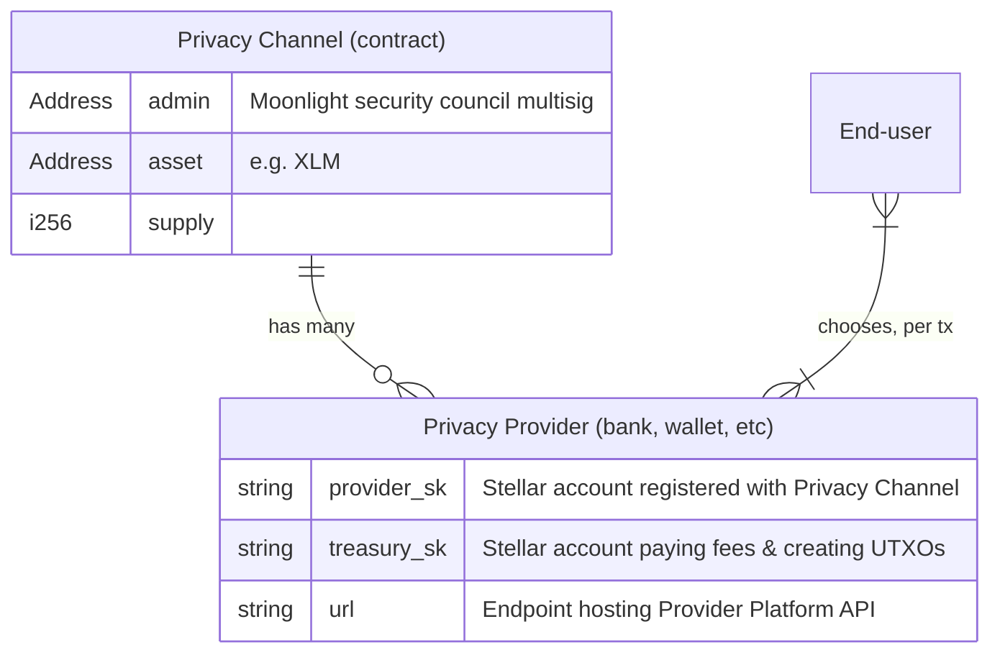

Moonlight
=========

Landing page. Plain HTML & CSS. Designed mostly by a robot.

Pushes to `main` auto-deploy to GitHub Pages.


Beta Test Moonlight
===================

Moonlight is on testnet! Help us test it.


How does Moonlight work?
------------------------

To start off, it will help you to know a little bit about how Moonlight is structured. Here's an idealized & simplified architecture diagram:



A **Privacy Channel** is a smart contract. We anticipate most Privacy Channels being created to account for transactions within a specific region / jurisdiction—picture one or more Privacy Channels for the USA, one or more for Europe, one or more for South America, etc.

**Privacy Providers** that adhere to a jurisdiction's regulations can join that channel, and multiple Privacy Channels with different groups of Providers can be created for each jurisdiction—picture USA Large Banks and USA Small Banks. Each group of providers can then decide whether and how to admit new providers into their club.

**End-users** can onboard to one or more privacy providers, and then choose per-transaction which to use. Users maintain custody of their own accounts, and send draft transactions to a privacy provider—"send 10 XLM to Alice, using high/medium/low obfuscation." The provider can then sign and submit the transaction to the network.

(Time will tell how common this per-transaction selection of privacy providers will be, once Moonlight reaches production on mainnet. It's possible that end-users will have a more traditional financial institution onboarding experience; that they will either switch to a new bank that supports Moonlight, or that their existing bank adds support for Moonlight, and then their familiar "send/receive" UI will use Moonlight on the backend, possibly without the user knowing anything about it.)

The obfuscation setting, also called entropy, determines how many sub-accounts, implemented as [UTXOs](https://en.wikipedia.org/wiki/Unspent_transaction_output), the transaction amount is broken into and tumbled through. In addition to the sender's & receiver's accounts being broken into UTXOs, the Privacy Provider will also mix other random UTXOs into the transaction, breaking traceability for outside observers.

If regulators have questions about certain transactions, they can audit privacy providers to tie Moonlight's UTXOs to specific accounts. If the privacy provider is a non-custodial wallet, these accounts will be regular Stellar/blockchain accounts or public keys, allowing regulatory agencies to proceed with traditional blockchain regulation approaches. (Note that Moonlight's UTXO accounts are on Stellar, but the source account could be on a different blockchain.) If the privacy provider is a custodial bank or financial institution, they will be able to tie UTXOs to real-world IDs.


What should you test?
---------------------

When we said above that "Moonlight is on testnet," we specifically meant that we have already deployed a Privacy Channel contract to testnet:

* Testnet Privacy Channel for Beta Test: [CDMZSHMT2AIL2UG7XBOHZKXM6FY3MUP75HAXUUSAHLGRQ2VWPGYKPM5T](https://stellar.expert/explorer/testnet/contract/CDMZSHMT2AIL2UG7XBOHZKXM6FY3MUP75HAXUUSAHLGRQ2VWPGYKPM5T)

You are welcome to test the entire workflow of Moonlight! If you are so motivated, go ahead and clone [the repositories](https://github.com/Moonlight-Protocol/), build the contracts, deploy your own Privacy Channel, and test the whole end-to-end workflow.

But the two main roles we would like your help testing are:

1. Privacy Providers
2. End-users

See the diagram & descriptions above, for what these are.

We recommend starting out by testing the End-User workflow, to get a feel for it. Then you can configure and deploy your own Privacy Provider to see if you can use it as well.


Use Moonlight via our custom wallet
-----------------------------------

### Step 1: Install the wallet

As stated in the "how it works" section above, we expect that most users will eventually use Moonlight from the UI of their bank, without even realizing that their experience is powered by Moonlight. For now, you need to use Moonlight via our custom wallet.

Our wallet is a Chrome browser extension, so you will need to use a Chrome-based browser like [Chrome itself](https://www.google.com/chrome/index.html) or [Brave](https://brave.com/).

On your [chrome://extensions](chrome://extensions) page, make sure you toggle "Developer Mode" to the "On" position in the top right.

Now download the latest version of our extension from [our Releases page](https://github.com/Moonlight-Protocol/browser-wallet/releases), selecting the Zip file containing the best version for your operating system. Unzip it.

Back in [chrome://extensions](chrome://extensions), click "Load unpacked" in the top left. Select the unzipped folder.

You should be good to go!

### Step 2: Create or import an account

Moonlight Wallet will have you create or import an account like many other crypto wallets. This may be familiar to you. Follow the instructions.

### Step 3: Add privacy channel

You need to tell your Moonlight Wallet what privacy channels & providers to use. 

Add a new Privacy Channel. Select the "Test" network and set the contract ID to the one shown above:

```
CDMZSHMT2AIL2UG7XBOHZKXM6FY3MUP75HAXUUSAHLGRQ2VWPGYKPM5T
```

You can set the "Provider Note" to anything you like; this appears only to you.

### Step 4: Add Privacy Providers

Just like Privacy Channels, the wallet extension doesn't know anything about Privacy Providers out-of-the-box. You need to configure it.

We've deployed two Privacy Providers for use on Testnet during this beta test. You can add them both. Click to add a provider. Make sure you select Test network and the Privacy Channel you already added. Then:

* Provider URL:
  * `moonlight-beta-privacy-provider-a.fly.dev`
  * `moonlight-beta-privacy-provider-b.fly.dev`
* Provider Note: Anything you want; this appears only to you. Perhaps "Provider A" and "Provider B"

### Step 5: Send & receive!

Go through steps 2-4 as many times as you like, creating multiple accounts.

Then you can send funds from one to the other!


Launch a Moonlight Privacy Provider
-----------------------------------

To create your own Privacy Provider, first you need to complete some on-chain setup, message us to register your provider with the beta test Privacy Channel, and then deploy a small API service.

### Step 1: Create Stellar accounts

As shown in the architecture diagram above, each Provider has two associated Stellar accounts. You can create these using whatever tool you like; we recommend [stellar-cli](https://developers.stellar.org/docs/tools/cli/install-cli):

```bash
stellar keys generate provider --network testnet --fund
stellar keys generate treasury --network testnet --fund
```

This will create two accounts, `provider` and `treasury`. You can get the public key for these with:

```bash
stellar keys address [provider|treasury]
```

And you can get the secret key (never share it!) with:

```bash
stellar keys show [provider|treasury]
```

### Step 2: Register Provider account with Privacy Channel

You'll need to message us to do this. You can open an issue here or reach out to someone from our team on Discord or Telegram. Tell us the public key of the provider to add to the privacy channel:

```bash
stellar keys address provider
```

### Step 3: Deploy API service

We deployed our two providers using [fly.io](https://fly.io/), so our [provider-platform](https://github.com/Moonlight-Protocol/provider-platform/) repository already has configuration files to make this easy.

Disclaimer: our expertise is not in hosting these sorts of services! You may know better. Better than us how to configure API services. Our fly.io config is not necessarily following best-practices; it is merely functional.

If you want to host your own Provider on Fly.io:

* Fork [Moonlight-Protocol/provider-platform](https://github.com/Moonlight-Protocol/provider-platform/tree/dev) to your own GitHub organization. You may want to set `dev` to be the primary branch, since this is the branch that contains everything interesting.

* Edit the `fly.toml` file on the `dev` branch, setting `OPEX_PUBLIC` to the public key of your `treasury` account:

  ```bash
  stellar keys address treasury
  ```

  ("OpEx" is what Moonlight calls these treasury accounts internally, short for "Operation Executor". This may change in future versions.)

  Also verify that `CHANNEL_CONTRACT_ID` is set to the Privacy Channel ID we specified above.

  Commit this change. If you didn't make the change right on the GitHub UI, make sure that you also push your change to your GitHub repository.

* In your Fly.io dashboard, deploy from GitHub, selecting this project. Make sure you set the branch to `dev`. Set Environment Variables for your secrets:

  * `PROVIDER_SK`: the value given by `stellar keys show provider`
  * `OPEX_SECRET`: the value given by `stellar keys show treasury`
  * `SERVICE_AUTH_SECRET`: ???
