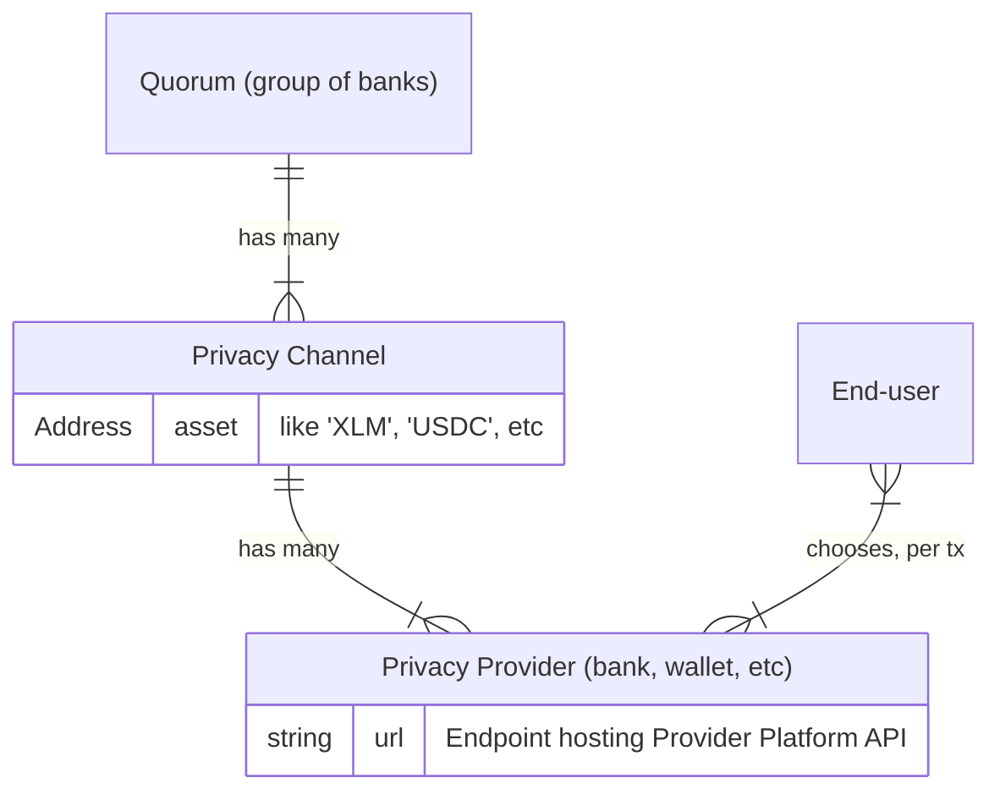

<!-- authoring here, copy-pasting to html file :[ -->
<!-- this is temporary!! -->

Beta Test Moonlight
===================

Moonlight is on testnet! Help us test it.


How does Moonlight work?
------------------------

In Moonlight, groups of banks, wallets, or other financial institutions can work together to create privacy channels and offer privacy-as-a-service to end-users, who are able to switch from one provider to another with ease, all while maintaining custody of their own funds and a consistent Moonlight wallet address. Think of this Moonlight wallet address as containing the best attributes of a cryptocurrency public key and a bank routing+account number. Like a bank routing+account number, it reveals nothing of a user's balance or transaction history. Like a cryptocurrency public key, it can be used as a consistent, public-facing pseudonym. 

Behind the scenes, these Moonlight wallet addresses get decomposed into many composite "addresses", implemented using a pattern familiar to Bitcoin and Cardano enthusiasts: UTXOs. One traditional public/private keypair can be used to derive endless UTXO "addresses" (they're not really addresses; not the way you think of them; not quite). Except: it's not behind the scenes. Not all of it. Transactions between these UTXOs all happens on-chain, on Stellar, out in the open. The part that's out-of-sight, behind the scenes, is onboarding: turning your crypto assets into funded UTXOs on Moonlight. This part requires a privacy provider, which will batch these onboarding events and create decoy UTXOs, to make it hard to trace one input address to the in-the-public UTXOs. Every transaction, every send-and-receive, also requires sign-off from a privacy provider, who can mix in a custom number of decoy UTXOs per-transaction, to customize the level of obfuscation based on the needs of the user.

In this way, privacy providers—and privacy providers alone—can tie Moonlight UTXOs to specific blockchain addresses. Which is to say: privacy providers, between the lot of them, maintain an audit trail. They can be audited. If a regulator audits a privacy provider, requesting information about specific transactions, the privacy provider can fulfill this request.

Did you catch all that? Moonlight provides _customizable_, _regulatory-friendly_, _non-custodial_ privacy for blockchain.

One more thing: any blockchain can be used as input. Moonlight UTXOs will still always be bookkept on Stellar's public ledger, but the input address, the input public key, can be from any blockchain. As can the destination address. Moonlight is implemented on Stellar, but not limited to it.



A **Quorum** is one or more banks, wallets, or financial intitutions, all probably co-located in a specific regulatory zone (like the USA, Europe, or South America).

Each Quorum can create one or more **Privacy Channels** for each asset they want to allow users to send & receive.

Each institution participating in the Quorum can act as a **Privacy Provider** for it. The existing Quorum also decides the rules for allowing new institutions/providers to join their Quorum.

**End-users** can onboard to one or more privacy providers, and then choose per-transaction which to use. Users maintain custody of their own accounts, and send draft transactions to a privacy provider—"send 10 XLM to Alice, using high/medium/low obfuscation." The provider can then sign and submit the transaction to the network.

(Time will tell how common this per-transaction selection of privacy providers will be, once Moonlight reaches production on mainnet. It's possible that end-users will have a more traditional financial institution onboarding experience; that they will either switch to a new bank that supports Moonlight, or that their existing bank adds support for Moonlight, and then their familiar "send/receive" UI will use Moonlight on the backend, possibly without the user knowing anything about it.)

The obfuscation setting, also called entropy, determines how many sub-accounts, implemented as [UTXOs](https://en.wikipedia.org/wiki/Unspent_transaction_output), the transaction amount is broken into and tumbled through. In addition to the sender's & receiver's accounts being broken into UTXOs, the Privacy Provider will also mix other random UTXOs into the transaction, breaking traceability for outside observers.

If regulators have questions about certain transactions, they can audit privacy providers to tie Moonlight's UTXOs to specific accounts. If the privacy provider is a non-custodial wallet, these accounts will be regular Stellar/blockchain accounts or public keys, allowing regulatory agencies to proceed with traditional blockchain regulation approaches. (Note that Moonlight's UTXO accounts are on Stellar, but the source account could be on a different blockchain.) If the privacy provider is a custodial bank or financial institution, they will be able to tie UTXOs to real-world IDs.


What should you test?
---------------------

When we said above that "Moonlight is on testnet," we specifically meant that we have already deployed a Privacy Channel contract to testnet:

* Testnet Privacy Channel for Beta Test: [CDMZSHMT2AIL2UG7XBOHZKXM6FY3MUP75HAXUUSAHLGRQ2VWPGYKPM5T](https://stellar.expert/explorer/testnet/contract/CDMZSHMT2AIL2UG7XBOHZKXM6FY3MUP75HAXUUSAHLGRQ2VWPGYKPM5T)

You are welcome to test the entire workflow of Moonlight! If you are so motivated, go ahead and build & deploy [the contracts](https://github.com/Moonlight-Protocol/soroban-core), deploy [your own Privacy Channel](https://github.com/Moonlight-Protocol/provider-platform), and test the whole end-to-end workflow. You could also just deploy your own Privacy Provider, and message us to get it added to the existing testnet privacy channel.

But first, you probably want to start by testing Moonlight as an end-user. This requires five steps:

### Step 1: Install the wallet

As stated in the "how it works" section above, we expect that most users will eventually use Moonlight from the UI of their bank, without even realizing that their experience is powered by Moonlight. For now, you need to use Moonlight via our custom wallet.

Our wallet is a Chrome browser extension, so you will need to use a Chrome-based browser like [Chrome itself](https://www.google.com/chrome/index.html) or [Brave](https://brave.com/).

On your [chrome://extensions](chrome://extensions) page, make sure you toggle "Developer Mode" to the "On" position in the top right.

Now download the latest version of our extension from [our Releases page](https://github.com/Moonlight-Protocol/browser-wallet/releases), selecting the Zip file containing the best version for your operating system. Unzip it.

Back in [chrome://extensions](chrome://extensions), click "Load unpacked" in the top left. Select the unzipped folder.

You should be good to go!

### Step 2: Create or import an account

Moonlight Wallet will have you create or import an account like many other crypto wallets. This may be familiar to you. Follow the instructions.

### Step 3: Add privacy channel

You need to tell your Moonlight Wallet what privacy channels & providers to use. 

Add a new Privacy Channel. Select the "Test" network and set the contract ID to the one shown above:

```
CDMZSHMT2AIL2UG7XBOHZKXM6FY3MUP75HAXUUSAHLGRQ2VWPGYKPM5T
```

You can set the "Provider Note" to anything you like; this appears only to you.

### Step 4: Add Privacy Providers

Just like Privacy Channels, the wallet extension doesn't know anything about Privacy Providers out-of-the-box. You need to configure it.

We've deployed two Privacy Providers for use on Testnet during this beta test. You can add them both. Click to add a provider. Make sure you select Test network and the Privacy Channel you already added. Then:

* Provider URL:
  * `moonlight-beta-privacy-provider-a.fly.dev`
  * `moonlight-beta-privacy-provider-b.fly.dev`
* Provider Note: Anything you want; this appears only to you. Perhaps "Provider A" and "Provider B"

Note that Provider A is located on servers in Amsterdam, and Provider B in São Paulo. You may want to prefer the one that results in faster API requests for your location.

### Step 5: Send & receive!

Go through steps 2-4 as many times as you like, creating multiple accounts.

Then you can send funds from one to the other!
